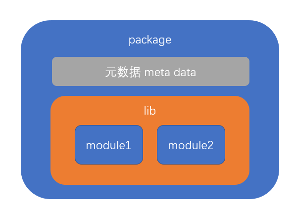
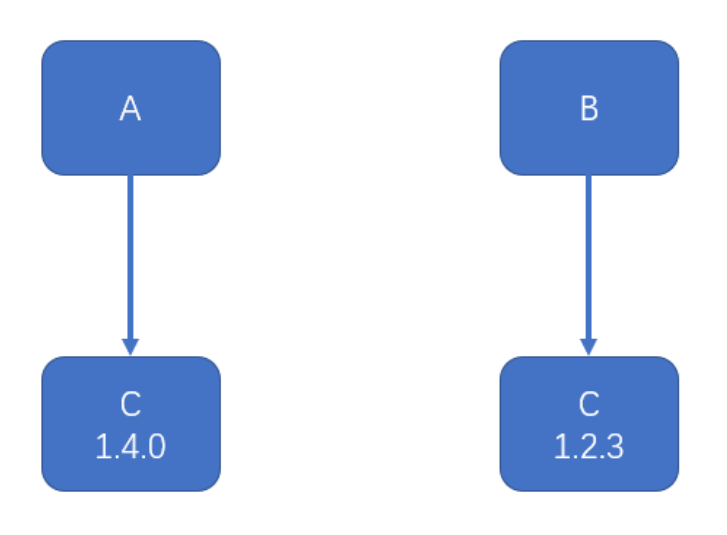
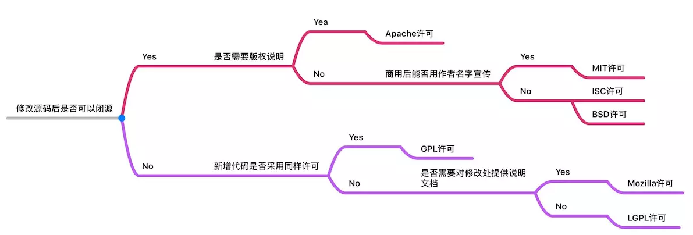

# 包管理器

## 包管理工具概述

### 1.概念

**模块（module）**

通常以单个文件形式存在的功能片段，入口文件通常称之为**入口模块**或**主模块**

**库（library，简称 lib）**

以一个或多个模块组成的完整功能块，为开发中某一方面的问题提供完整的解决方案

**包（package）**

包含元数据的库，这些元数据包括：名称、描述、git 主页、许可证协议、作者、依赖等等



### 2.背景

CommonJS 的出现，使 node 环境下的 JS 代码可以用模块更加细粒度的划分。一个类、一个函数、一个对象、一个配置等等均可以作为模块，这种细粒度的划分，是开发大型应用的基石。
为了解决在开发过程中遇到的常见问题，比如加密、提供常见的工具方法、模拟数据等等，一时间，在前端社区涌现了大量的第三方库。这些库使用 CommonJS 标准书写而成，非常容易使用。
然而，在下载使用这些第三方库的时候，遇到难以处理的问题：

- **下载过程繁琐**
  - 进入官网或 github 主页
  - 找到并下载相应的版本
  - 拷贝到工程的目录中
  - 如果遇到有同名的库，需要更改名称
- **如果该库需要依赖其他库，还需要按照要求先下载其他库**
- **开发环境中安装的大量的库如何在生产环境中还原，又如何区分**
- **更新一个库极度麻烦**
- **自己开发的库，如何在下一次开发使用**

**以上问题，就是包管理工具要解决的问题**

### 3.前端包管理器

几乎可以这样认为，前端所有的包管理器都是基于 npm 的，目前，npm 即是一个包管理器，也是其他包管理的基石
npm 全称为 node package manager，即 node 包管理器，它运行在 node 环境中，让开发者可以用简单的方式完成包的查找、安装、更新、卸载、上传等操作

> npm 之所以要运行在 node 环境，而不是浏览器环境，根本原因是因为浏览器环境无法提供下载、删除、读取本地文件的功能。而 node 属于服务器环境，没有浏览器的种种限制，理论上可以完全掌控运行 node 的计算机。

npm 的出现，弥补了 node 没有包管理器的缺陷，于是很快，node 在安装文件中内置了 npm，当开发者安装好 node 之后，就自动安装了 npm，不仅如此，node 环境还专门为 npm 提供了良好的支持，使用 npm 下载的包更加方便了。

npm 由三部分组成：

- registry：入口
  - 可以把它想象成一个庞大的数据库
  - 第三方库的开发者，将自己的库按照 npm 的规范，打包上传到数据库中
  - 使用者通过统一的地址下载第三方包
- 官网：[https://www.npmjs.com/](https://www.npmjs.com/)
  - 查询包
  - 注册、登录、管理个人信息
- CLI：command-line interface 命令行接口
  - 这一部分是本门课讲解的重点
  - 安装好 npm 后，通过 CLI 来使用 npm 的各种功能
  - vscode 里面 Ctrl+j

cmd 常用命令
换到 e 盘：e:
查看目录：dir
vscode
查看 npm 的当前版本
输入 npm -v 或者 npm --version 注意空格

> node 和 npm 是互相成就的，node 的出现让 npm 火了，npm 的火爆带动了大量的第三方库的发展，很多优秀的第三方库打包上传到了 npm，这些第三方库又为 node 带来了大量的用户

## npm

### 包的安装

> 安装（install）即下载包
> 由于 npm 的官方 registry 服务器位于国外，可能受网速影响导致下载缓慢或失败。因此，安装好 npm 之后，需要重新设置 registry 的地址为国内地址。目前，淘宝 [https://registry.npm.taobao.org](https://registry.npm.taobao.org) 提供了国内的 registry 地址，先设置到该地址。设置方式为`npm config set registry [https://registry.npm.taobao.org](https://registry.npm.taobao.org)`。设置好后，通过命令`npm config get registry`进行检查
> 

npm 安装一个包，分为两种安装方式：

1. 本地安装
2. 全局安装

#### 1.本地安装

使用命令`npm install 包名`或`npm i 包名`即可完成本地安装
终端 clear 是清除命令
本地安装的包出现在当前目录下的`node_modules`目录中

> 随着开发的进展，`node_modules`目录会变得异常庞大，目录下的内容不适合直接传输到生产环境，因此通常使用`.gitignore`文件忽略该目录中的内容
> 本地安装适用于绝大部分的包，它会在当前目录及其子目录中发挥作用
> 通常在项目的根目录中使用本地安装
> 安装一个包的时候，npm 会自动管理依赖，它会下载该包的依赖包到`node_modules`目录中
> 例如：react
> 如果本地安装的包带有 CLI，npm 会将它的 CLI 脚本文件放置到`node_modules/.bin`下，使用命令`npx 命令名`即可调用（npx mocha）
> 例如：mocha

演示
安装 jQuery：命令 npm install jquery

#### 2.全局安装

全局安装的包放置在一个特殊的全局目录，该目录可以通过命令`npm config get prefix`查看
使用命令`npm install --global 包名` 或 `npm i -g 包名`
重要：**全局安装的包并非所有工程可用，它仅提供全局的 CLI 工具**
大部分情况下，都不需要全局安装包，除非：

1. 包的版本非常稳定，很少有大的更新
2. 提供的 CLI 工具在各个工程中使用的非常频繁
3. CLI 工具仅为开发环境提供支持，而非部署环境

### 包配置

> 前节补充：同时下载两个包：命令 npm i jquery loadsh

目前遇到的问题：

1. 拷贝工程后如何还原？
2. 如何区分开发依赖和生产依赖？
3. 如果自身的项目也是一个包，如何描述包的信息

以上这些问题都需要通过包的**配置文件**解决

#### 1.配置文件

npm 将每个使用 npm 的工程本身都看作是一个包，包的信息需要通过一个名称固定的配置文件来描述
**配置文件的名称固定为：package.json**
可以手动创建该文件，而更多的时候，是通过命令`npm init`创建的
配置文件中可以描述大量的信息，包括：

- name：包的名称，该名称必须是**英文单词字符**，支持连接符
- version：版本
  - 版本规范：主版本号.次版本号.补丁版本号
  - 主版本号：仅当程序发生了重大变化时才会增长，如新增了重要功能、新增了大量的 API、技术架构发生了重大变化
  - 次版本号：仅当程序发生了一些小变化时才会增长，如新增了一些小功能、新增了一些辅助型的 API
  - 补丁版本号：仅当解决了一些 bug 或 进行了一些局部优化时更新，如修复了某个函数的 bug、提升了某个函数的运行效率
- description：包的描述
- homepage：官网地址
- author：包的作者，必须是有效的 npm 账户名，书写规范是 `account <mail>`，例如：`zhangsan <zhangsan@gmail.com>`，不正确的账号和邮箱可能导致发布包时失败
- repository：包的仓储地址，通常指 git 或 svn 的地址，它是一个对象
  - type：仓储类型，git 或 svn
  - url：地址

命令：get remote -v

- main：包的入口文件，使用包的人默认从该入口文件导入包的内容
- keywords: 搜索关键字，发布包后，可以通过该数组中的关键字搜索到包
  > 一步到位简化配置 json 文件

使用`npm init --yes`或`npm init -y`可以在生成配置文件时自动填充默认配置
操作：创建一个英文文件夹，右键终端打开，输入`npm init --yes`或`npm init -y`

#### 2.保存依赖关系

大部分时候，我们仅仅是开发项目，并不会把它打包发布出去，尽管如此，我们仍然需要 package.json 文件
**package.json 文件最重要的作用，是记录当前工程的依赖**

- dependencies：生产环境的依赖包
- devDependencies：仅开发环境的依赖包

```json
"dependencies": {
    "jquery": "latest",//不推荐最新，防止开发冲突
    "lodash": "4.17.15"
},
"devDependencies": {
    "mocha": "6.2.2"
}
```

配置好依赖后，使用下面的命令即可安装依赖

```shell
## 本地安装所有依赖 dependencies + devDependencies
npm install
npm i

## 仅安装生产环境的依赖 dependencies
npm install --production
```

这样一来，代码移植就不是问题了，只需要移植源代码和 package.json 文件，不用移植 node_modules 目录，然后在移植之后通过命令即可重新恢复安装
为了更加方便的添加依赖，npm 支持在使用 install 命令时，加入一些额外的参数，用于将安装的依赖包保存到 package.json 文件中(自动地)
涉及的命令如下

```shell
## 安装依赖到生产环境
npm i 包名
npm i --save 包名
npm i -S 包名

## 安装依赖到开发环境
npm i --save-dev 包名
npm i -D 包名
```

安装包之后 package.json 会自动生成：

```json
 "dependencies": {
     "jquery": "^3.4.1",
     "lodash": "^4.17.15"
 },
 "devDependencies": {
     "mocha": "^6.2.2"
 }
```

> 自动保存的依赖版本，例如`^15.1.3`，这种书写方式叫做语义版本号（semver version），具体规则后续讲解

### 包的使用

> 引入模块：npm init---chapter2---回车----回车----npm i lodash 安装成功

nodejs 对 npm 支持非常良好
使用 nodejs 导入模块时传统方法：

```javascript
var _ = require("./node_modules/lodash/index");
// 习惯用下划线命名
console.log(_);
运行命令：node index.js
```

返回的里面有很多方法，例如：compact

```javascript
var arr = _.compact([1, 3, 0, '', false, 5])
// compact会把数组里面判定为假的除去，返回新数组
console.log(arr)
```

当使用 nodejs 导入模块时，如果模块路径不是以 ./ 或 ../ 开头，则 node 会认为导入的模块来自于 node_modules 目录，例如：

```javascript
var _ = require('lodash')
```

它首先会从当前目录的以下位置寻找文件

```shell
node_modules/lodash.js
node_modules/lodash/入口文件
```

若当前目录没有这样的文件，则会回溯到上级目录按照同样的方式查找

> **运行命令：包管理器\2. npm\2-3. 包的使用> node .\sub\test.js**

如果到顶级目录都无法找到文件，则抛出错误 `Cannot find module 'jquery'`
上面提到的入口文件按照以下规则确定

1. 查看导入包的 package.json 文件，读取 main 字段作为入口文件
2. 若不包含 main 字段，则使用 index.js 作为入口文件
   > 入口文件的规则同样适用于自己工程中的模块
   > 自己工程中的模块为 a 作为举例：

```html
// 首先，查看当前目录是否有 a.js //
把a当作文件夹，并且，把该文件夹当作一个包，看该包中是否有package.json文件，读取main字段。。。。 var a = require("./a");
console.log(a)
```

> 在 node 中，还可以手动指定路径来导入相应的文件，这种情况比较少见

```javascript
var test = require('lodash/fp/add')
console.log(test)
```

### 简易数据爬虫

> 补充： require 导入一个包，如果以./或../开头，就导入自己写的文件。如果没有写，就导入 node_modules 下面的模块
> 特殊情况：导入模块是一个特殊名字，使用 nodejs 自带的模块。（require("fs")）

初始化：命令 npm init 生成 package.js 文件
将豆瓣电影的电影数据抓取下来，保存到本地文件 movie.json 中
需要用到的包：用法通过 npm 网站查询

1. axios：专门用于在各种环境中发送网络请求，并获取到服务器响应结果

   > 安装 npm i axios,   运行 node .\index.js

1. cheerio：jquery 的核心逻辑包，支持所有环境，可用于讲一个 html 字符串转换成为 jquery 对象，并通过 jquery 对象完成后续操作
1. fs：node 核心模块，专门用于文件处理
   - fs.writeFile(文件名, 数据)

## 语义版本

思考：如果你编写了一个包 A，依赖另外一个包 B，你在编写代码时，包 B 的版本是 2.4.1，你是希望使用你包的人一定要安装包 B，并且是 2.4.1 版本，还是希望他可以安装更高的版本，如果你希望它安装更高的版本，高的什么程度呢
回顾：版本号规则
版本规范：主版本号.次版本号.补丁版本号

- 主版本号：仅当程序发生了重大变化时才会增长，如新增了重要功能、新增了大量的 API、技术架构发生了重大变化
- 次版本号：仅当程序发生了一些小变化时才会增长，如新增了一些小功能、新增了一些辅助型的 API
- 补丁版本号：仅当解决了一些 bug 或 进行了一些局部优化时更新，如修复了某个函数的 bug、提升了某个函数的运行效率

有的时候，我们希望：安装我的依赖包的时候，次版本号和补丁版本号是可以有提升的，但是主版本号不能变化

有的时候，我们又希望：安装我的依赖包的时候，只有补丁版本号可以提升，其他都不能提升

甚至我们希望依赖包保持固定的版本，尽管这比较少见

这样一来，就需要在配置文件中描述清楚具体的依赖规则，而不是直接写上版本号那么简单。

这种规则的描述，即**语义版本**

语义版本的书写规则非常丰富，下面列出了一些常见的书写方式

| 符号 | 描述                 | 示例          | 示例描述                                                           |
| ---- | -------------------- | ------------- | ------------------------------------------------------------------ |
| >    | 大于某个版本         | >1.2.1        | 大于 1.2.1 版本                                                    |
| >=   | 大于等于某个版本     | >=1.2.1       | 大于等于 1.2.1 版本                                                |
| <    | 小于某个版本         | <1.2.1        | 小于 1.2.1 版本                                                    |
| <=   | 小于等于某个版本     | <=1.2.1       | 小于等于 1.2.1 版本                                                |
| -    | 介于两个版本之间     | 1.2.1 - 1.4.5 | 介于 1.2.1 和 1.4.5 之间                                           |
| x    | 不固定的版本号       | 1.3.x         | 只要保证主版本号是 1，次版本号是 3 即可                            |
| ~    | 补丁版本号可增       | ~1.3.4        | 保证主版本号是 1，次版本号是 3，补丁版本号大于等于 4               |
| ^    | 此版本和补丁版本可增 | ^1.3.4        | 保证主版本号是 1，次版本号可以大于等于 3，补丁版本号可以大于等于 4 |
| \*   | 最新版本             | \*            | 始终安装最新版本                                                   |

### 1.避免还原的差异

版本依赖控制始终是一个两难的问题
如果允许版本增加，可以让依赖包的 bug 得以修复（补丁版本号），可以带来一些意外的惊喜（次版本号），但同样可能带来不确定的风险（新的 bug）
如果不允许版本增加，可以获得最好的稳定性，但失去了依赖包自我优化的能力
而有的时候情况更加复杂，如果依赖包升级后，依赖也发生了变化，会有更多不确定的情况出现
基于此，npm 在安装包的时候，会自动生成一个 package-lock.json 文件，该文件记录了安装包时的确切依赖关系
当移植工程时，如果移植了 package-lock.json 文件，恢复安装时，会按照 package-lock.json 文件中的确切依赖进行安装，最大限度的避免了差异

### 2.[扩展]npm 的差异版本处理

如果两个包依赖同一个包的不同版本，如下图




面对这种情况，在 node_modules 目录中，不会使用扁平的目录结构，而会形成嵌套的目录，如下图：

```html
├── node_modules │ ├── a │ │ ├── node_modules │ │ │ ├── c │ │ │ | |—— c包的文件 │ │ │── a包的文件 │ ├── b │ │ ├──
node_modules │ │ │ ├── c │ │ │ | |—— c包的文件 │ │ │── b包的文件
```

## npm 脚本 （npm scripts）

在开发的过程中，我们可能会反复使用很多的 CLI 命令，例如：

- 启动工程命令（node 或 一些第三方包提供的 CLI 命令）
- 部署工程命令（一些第三方包提供的 CLI 命令）
- 测试工程命令（一些第三方包提供的 CLI 命令）

这些命令纷繁复杂，根据第三方包的不同命令也会不一样，非常难以记忆
于是，npm 非常贴心的支持了脚本，只需要在 package.json 中配置 scripts 字段，即可配置各种脚本名称
之后，我们就可以运行简单的指令来完成各种操作了
运行方式是 `npm run 脚本名称`
不仅如此，npm 还对某些常用的脚本名称进行了简化，下面的脚本名称是不需要使用 run 的：

- start **可以简化成 npm start**
- stop
- test

一些细节：

- 脚本中可以省略 npx
- start 脚本有默认值：node server.js

演示

> 启动 node 方式一：

js 文件终端打开，初始化创建 package.json 文件，node .\index.js

> 启动 node 方式二：

第三方工具 npm in nodemon
输入命令：npx nodemon .\index.js
可以不断刷新运行，想停止：ctrl+c
以上两种方式要记着，太麻烦了
所以在 package.json 里面加上

```json
{
  "scripts": {
    "start": "nodemon index.js",
    "start": "npx nodemon index.js",
    "trick": "chrome https://www.baidu.com",
    "trick": "dir"
  }
}
```

向运行 node,这次就直接 npm run start/trick
这里可以配置各种命令

## 运行环境配置

我们书写的代码一般有三种运行环境：

1. 开发环境
2. 生产环境
3. 测试环境

有的时候，我们可能需要在 node 代码中根据不同的环境做出不同的处理
如何优雅的让 node 知道处于什么环境，是极其重要的
通常我们使用如下的处理方式：
node 中有一个全局变量 global (可以类比浏览器环境的 window)，该变量是一个对象，对象中的所有属性均可以直接使用
global 有一个属性是 process，该属性是一个对象，包含了当前运行 node 程序的计算机的很多信息，其中有一个信息是 env，是一个对象，包含了计算机中所有的系统变量
设置环境变量：
名字：NODE_ENV
值：development
通常，我们通过系统变量 NODE_ENV 的值，来判定 node 程序处于何种环境

```javascript
var a = '没有环境变量'
// 此电脑属性高级系统设置进行配置
// console.log(process.env.NODE_ENV)//development

if (process.env.NODE_ENV === 'development') {
  a = '开发环境'
} else if (process.env.NODE_ENV === 'production') {
  a = '生产环境'
} else if (process.env.NODE_ENV === 'test') {
  a = '测试环境'
}
console.log(a)
```

有两种方式设置 NODE_ENV 的值

1. 永久设置
2. 临时设置

我们一般使用临时设置

因此，我们可以配置 scripts 脚本，在设置好了 NODE_ENV 后启动程序

```javascript
//开发环境
"start": "set NODE_ENV=development&&node index.js",//这里不能有空格
 //在package.json里面配置：相当于设置NODE_ENV为development并且执行index.js
//生产环境
"build": "set NODE_ENV=production&&node index.js
//测试环境
"build": "set NODE_ENV=test&&node index.js
```

> 为了避免不同系统(macOS windows 不同)的设置方式的差异，可以使用第三方库 cross-env 对环境变量进行设置

安装
npm i --D cross-env
表示开发依赖

```javascript
"start": "cross-env NODE_ENV=development node index.js",
"build": "cross-env NODE_ENV=production node index.js",
"test": "cross-env NODE_ENV=test node index.js"


npm start;
npm run build;
npm test;
```

### 在 node 中读取 package.json

有的时候，我们可能在 package.json 中配置一些自定义的字段，这些字段需要在 node 中读取
在 node 中，可以直接导入一个 json 格式的文件，它会自动将其转换为 js 对象

```javascript
//读取package.json文件中的版本号

var config = require('./package.json')
console.log(config.version)
console.log(config.a)
```

## 其他 npm 命令

### 1.安装

1. 精确安装最新版本

```shell
npm install --save-exact 包名
npm install -E 包名
```

2. 安装指定版本

```shell
npm install 包名@版本号
```

### 2.查询

1. 查询包安装路径

```shell
npm root [-g]
```

2. 查看包信息

```shell
npm view 包名 [子信息]
## view aliases：v info show

依赖的包：npm v react dependencies
版本：npm v react version
```

3. 查询安装包

```shell
npm list [-g] [--depth=依赖深度]//0开始
## list aliases: ls  la  ll
```

### 3.更新

1. 检查有哪些包需要更新

```shell
npm outdated
```

2. 更新包

```shell
npm update [-g] [包名]
## update 别名（aliases）：up、upgrade
```

用 npm 安装最新版的 npm
npm i -g npm

### 4.卸载包

```shell
npm uninstall [-g] 包名
## uninstall aliases: remove, rm, r, un, unlink
```

### 5.npm 配置

npm 的配置会对其他命令产生或多或少的影响
安装好 npm 之后，最终会产生两个配置文件，一个是用户配置，一个是系统配置，当两个文件的配置项有冲突的时候，用户配置会覆盖系统配置
通常，我们不关心具体的配置文件，而只关心最终生效的配置
通过下面的命令可以查询目前生效的各种配置

```shell
npm config ls [-l] [--json]
```

另外，可以通过下面的命令操作配置

1. 获取某个配置项

```shell
npm config get 配置项
```

2. 设置某个配置项

```shell
npm config set 配置项=值
```

3. 移除某个配置项

```shell
npm config delete 配置项
```

## 发布包

### 1.准备工作

1. 移除淘宝镜像源

命令：npm config delete registry
检查：npm config get registry

2. 到 npm 官网注册一个账号，并完成邮箱认证
3. 本地使用 npm cli 进行登录
   1. 使用命令`npm login`登录
   2. 使用命令`npm whoami`查看当前登录的账号
   3. 使用命令`npm eggut`注销
4. 创建工程根目录
5. 使用 npm init 进行初始化（包名必须是小写） author：bnagbangji <1111@qq.com>
6. 创建 LICENSE 使用刚才使用的协议

### 2.发布

1. 开发
2. 确定版本
3. 使用命令`npm publish`完成发布

### 开源协议



可以通过网站 [http://choosealicense.online/appendix/](http://choosealicense.online/appendix/) 选择协议，并复制协议内容

# yarn    

## yarn 简介

> yarn 官网：[https://www.yarnpkg.com/zh-Hans/](https://www.yarnpkg.com/zh-Hans/)
> yarn -v 是否安装成功

yarn 是由 Facebook、Google、Exponent 和 Tilde 联合推出了一个新的 JS 包管理工具，**它仍然使用 npm 的 registry**，不过提供了全新 CLI 来对包进行管理
过去，yarn 的出现极大的抢夺了 npm 的市场，甚至有人戏言，npm 只剩下一个 registry 了。
之所以会出现这种情况，是因为在过去，npm 存在下面的问题：

- 依赖目录嵌套层次深：过去，npm 的依赖是嵌套的，这在 windows 系统上是一个极大的问题，由于众所周知的原因，windows 系统无法支持太深的目录
- 下载速度慢
  - 由于嵌套层次的问题，所以 npm 对包的下载只能是串行的，即前一个包下载完后才会下载下一个包，导致带宽资源没有完全利用
  - 多个相同版本的包被重复的下载
- 控制台输出繁杂：过去，npm 安装包的时候，每安装一个依赖，就会输出依赖的详细信息，导致一次安装有大量的信息输出到控制台，遇到错误极难查看
- 工程移植问题：由于 npm 的版本依赖可以是模糊的，可能会导致工程移植后，依赖的确切版本不一致。

针对上述问题，yarn 从诞生那天就已经解决，它用到了以下的手段：

- 使用扁平的目录结构
- 并行下载
- 使用本地缓存
- 控制台仅输出关键信息
- 使用 yanr-lock 文件记录确切依赖

不仅如此，yarn 还优化了以下内容：

- 增加了某些功能强大的命令
- 让既有的命令更加语义化
- 本地安装的 CLI 工具可以使用 yarn 直接启动
- 将全局安装的目录当作一个普通的工程，生成 package.json 文件，便于全局安装移植

全局安装目录：
npm root -g
yarn 的出现给 npm 带来了巨大的压力，很快，npm 学习了 yarn 先进的理念，不断的对自身进行优化，到了目前的 npm6 版本，几乎完全解决了上面的问题：

- 目录扁平化
- 并行下载
- 本地缓存 （清空缓存：npm chache clean）
- 使用 package-lock 记录确切依赖
- 增加了大量的命令别名
- 内置了 npx，可以启动本地的 CLI 工具
- 极大的简化了控制台输出

**总结**
npm6 之后，可以说 npm 已经和 yarn 非常接近，甚至没有差距了。很多新的项目，又重新从 yarn 转回到 npm。
这两个包管理器是目前的主流，都必须要学习。

### yarn 的核心命令

1. **初始化**

初始化：`yarn init [--yes/-y]`

2. **安装**

添加指定包：`yarn [global] add package-name [--dev/-D] [--exact/-E]  全局安装    `

```javascript
yarn global add nodemon
```

安装 package.json 中的所有依赖：`yarn install [--production/--prod]`

3. **脚本和本地 CLI**

运行脚本：`yarn run 脚本名`

> start、stop、test 可以省略 run

运行本地安装的 CLI：`yarn run CLI名`

4. **查询**

查看 bin 目录：`yarn [global] bin`
查询包信息：`yarn info 包名 [子字段]`
`yarn info 包名 version`
列举已安装的依赖：`yarn [global] list [--depth=依赖深度]`

> yarn 的 list 命令和 npm 的 list 不同，yarn 输出的信息更加丰富，包括顶级目录结构、每个包的依赖版本号

5. **更新**

列举需要更新的包：`yarn outdated`
更新包：`yarn [global] upgrade [包名]`

6. **卸载**

卸载包：`yarn remove 包名`

### yarn 的特别礼物

在终端命令上，yarn 不仅仅是对 npm 的命令做了一个改名，还增加了一些原本没有的命令，这些命令在某些时候使用起来非常方便

1. **yarn check**

使用`yarn check`命令，可以验证 package.json 文件的依赖记录和 lock 文件是否一致

这对于防止篡改非常有用

2. **yarn audit**

使用`yarn audit`命令，可以检查本地安装的包有哪些已知漏洞，以表格的形式列出，漏洞级别分为以下几种：

- INFO：信息级别

```javascript
module.exports = function (...args) {
  // 求和，没有考虑到字符串输入会导致拼接
  return args.reduce((s, item) => s + item, 0)
}
```

- LOW: 低级别
- MODERATE：中级别
- HIGH：高级别
- CRITICAL：关键级别

3. **yarn why**

使用`yarn why 包名`命令，可以在控制台打印出为什么安装了这个包，哪些包会用到它

4. **yarn create**

非常有趣的命令

今后，我们会学习一些脚手架，所谓脚手架，就是使用一个命令来搭建一个工程结构

过去，我们都是使用如下的做法：

1. 全局安装脚手架工具
2. 使用全局命令搭建脚手架

由于大部分脚手架工具都是以`create-xxx`的方式命名的，比如 react 的官方脚手架名称为`create-react-app`

因此，可以使用`yarn create`命令来一步完成安装和搭建

例如：

```shell
yarn create react-app my-app
# 等同于下面的两条命令
yarn global add create-react-app
create-react-app my-app
```

## 其他包管理器

### cnpm

> 官网地址：[https://npm.taobao.org/](https://npm.taobao.org/)

为解决国内用户连接 npm registry 缓慢的问题，淘宝搭建了自己的 registry，即淘宝 npm 镜像源

过去，npm 没有提供修改 registry 的功能，因此，淘宝提供了一个 CLI 工具即 cnpm，它支持除了`npm publish`以外的所有命令，只不过连接的是淘宝镜像源

如今，npm 已经支持修改 registry 了，可能 cnpm 唯一的作用就是和 npm 共存，即如果要使用官方源，则使用 npm，如果使用淘宝源，则使用 cnpm

```javascript
npm install -g cnpm --registry=https://registry.npm.taobao.org
```

### nvm

nvm 并非包管理器，它是用于管理多个 node 版本的工具

在实际的开发中，可能会出现多个项目分别使用的是不同的 node 版本，在这种场景下，管理不同的 node 版本就显得尤为重要

nvm 就是用于切换版本的一个工具

#### 1.下载和安装

最新版下载地址：[https://github.com/coreybutler/nvm-windows/releases](https://github.com/coreybutler/nvm-windows/releases)

下载 nvm-setup.zip 后，直接安装
一路下一步，不要改动安装路径（开发类工具尽量不该动）

#### 2.使用 nvm

nvm 提供了 CLI 工具，用于管理 node 版本

管理员运行输入 nvm，以查看各种可用命令
nvm arch：打印系统版本和默认 node 架构类型
nvm install 8.5.4：nvm 安装指定的 node 版本
nvm list ：列出目前电脑上使用的以及已经安装过的那些 node 版本
npm list available：node 版本

> 为了加快下载速度，建议设置淘宝镜像
> node 淘宝镜像：[https://npm.taobao.org/mirrors/node/](https://npm.taobao.org/mirrors/node/)
> npm 淘宝镜像：[https://npm.taobao.org/mirrors/npm/](https://npm.taobao.org/mirrors/npm/)

nvm node \_mirror [https://npm.taobao.org/mirrors/node/](https://npm.taobao.org/mirrors/node/)
nvm npm_mirror [https://npm.taobao.org/mirrors/npm/](https://npm.taobao.org/mirrors/npm/)
查看全局安装包：npm -g list --depth=0
切换 node 版本：nvm use 10.18.0
看 node 版本：node -v
卸载：nvm uninstall 10.18.0

### pnpm

pnpm 是一种新起的包管理器，从 npm 的下载量看，目前还没有超过 yarn，但它的实现方式值得主流包管理器学习，某些开发者极力推荐使用 pnpm

从结果上来看，它具有以下优势：

1. 目前，安装效率高于 npm 和 yarn 的最新版
2. 极其简洁的 node_modules 目录
3. 避免了开发时使用间接依赖的问题（之前的包管理器可以使用间接依赖不报错）pnpm 没有把间接依赖直接放入 node_modules 里面
4. 能极大的降低磁盘空间的占用
5. 使用缓存

#### 1.安装和使用

全局安装 pnpm

```shell
npm install -g pnpm
```

之后在使用时，只需要把 npm 替换为 pnpm 即可

如果要执行安装在本地的 CLI，可以使用 pnpx，它和 npx 的功能完全一样，唯一不同的是，在使用 pnpx 执行一个需要安装的命令时，会使用 pnpm 进行安装

> 比如`npx mocha`执行本地的`mocha`命令时，如果`mocha`没有安装，则 npx 会自动的、临时的安装 mocha，安装好后，自动运行 mocha 命令
> 类似：npx create-react-app my-app 临时下载 create-react-app，然后自动运行命令

#### 2.pnpm 原理

1. 同 yarn 和 npm 一样，pnpm 仍然使用缓存来保存已经安装过的包，以及使用 pnpm-lock.yaml 来记录详细的依赖版本

缓存位于工程所在盘的根目录，所以位置不固定

2. 不同于 yarn 和 npm， pnpm 使用**符号链接和硬链接**（可将它们想象成快捷方式）的做法来放置依赖，从而规避了从缓存中拷贝文件的时间，使得安装和卸载的速度更快
3. 由于使用了**符号链接和硬链接**，pnpm 可以规避 windows 操作系统路径过长的问题，因此，它选择使用树形的依赖结果，有着几乎完美的依赖管理。也因为如此，项目中只能使用直接依赖，而不能使用间接依赖

#### 3.注意事项

由于 pnpm 会改动 node_modules 目录结构，使得每个包只能使用直接依赖，而不能使用间接依赖，因此，如果使用 pnpm 安装的包中包含间接依赖，则会出现问题(**现在不会了，除非使用了绝对路径**)

由于 pnpm 超高的安装卸载效率，越来越多的包开始修正之前的间接依赖代码

### bower

浏览器端

> 过时了
